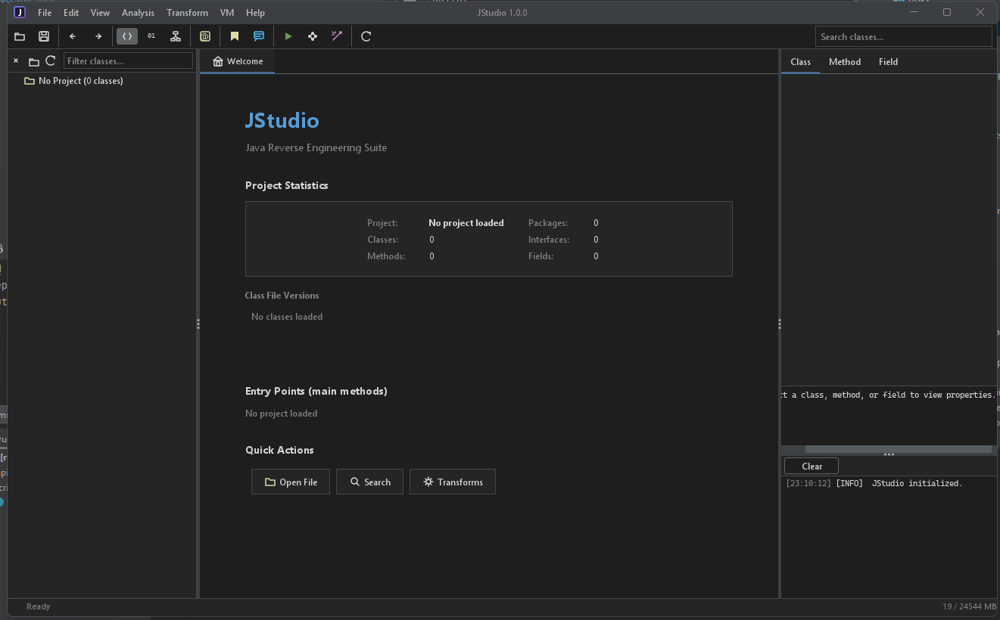

A Java reverse engineering and static analysis IDE for analyzing, decompiling, and transforming Java bytecode.

Powered by [YABR](https://github.com/Tonic-Box/YABR)

## Features

### Multi-View Editor

**Code Views**
- **Source** - Decompiled Java with syntax highlighting
- **Bytecode** - JVM instructions with color-coded opcodes

**IR Views**
- **SSA IR** - Static Single Assignment intermediate representation
- **AST IR** - Abstract Syntax Tree representation

**Other**
- **Const Pool** - Constant pool entry browser
- **Hex** - Raw class file bytes

### Graph Visualization

Interactive graph views with drag panning, zoom, and DOT export:

- **Control Flow** - Basic block CFG with bytecode/IR toggle
- **PDG** - Program Dependence Graph (data + control dependencies)
- **SDG** - System Dependence Graph (interprocedural)
- **CPG** - Code Property Graph (unified representation)

### Analysis Tools

- **Call Graph** - Method call hierarchy visualization
- **Dependencies** - Class dependency graphs with cycle detection
- **Data Flow** - Forward/backward flow analysis with taint tracking
- **Pattern Search** - Find method calls, field access, allocations, type casts
- **Similarity** - Detect duplicate and renamed methods
- **Simulation** - Find opaque predicates, dead code, decryption patterns
- **Strings** - Extract and search constant pool strings
- **Query Explorer** - Flexible query builder for code searches
- **Cross-References** - Bidirectional symbol reference tracking

### Bytecode Debugger

- **Breakpoints** - Set breakpoints on any instruction
- **Stepping** - Step into, over, out, run to cursor
- **Variable Inspection** - View and edit locals and stack
- **Call Stack** - Navigate stack frames
- **Execution Modes** - Stub mode (fast) or recursive mode (full)
- **Tracing** - Record execution history, export to Markdown

### Heap Analysis

- **Object Browser** - Explore allocated objects by class
- **Field Inspection** - View object fields and arrays
- **Snapshots** - Capture and compare heap state
- **Forensics** - Track object creation and mutations

### Test Generation

- **Method Execution** - Run methods with custom arguments
- **Fuzz Testing** - Automated input generation
- **JUnit Export** - Generate JUnit 4/5 test cases

### Deobfuscation

- **String Detection** - Find encrypted strings
- **Decryptor ID** - Locate decryption methods
- **Auto-Decrypt** - Execute decryptors to reveal strings
- **Name Recovery** - Deobfuscate class/method/field names

### Code Transformation

- **Script Editor** - Custom scripting language for AST/bytecode/IR manipulation
- **Optimizations** - Constant folding, copy propagation, dead code elimination, strength reduction
- **Stack Frames** - Recompute stack map frames

### UI

- Tabbed editor with multiple views per class
- Navigator tree with package hierarchy
- Properties panel for metadata
- Console with multi-level logging
- 8 built-in themes

## Building & Running

```bash
./gradlew run              # Run directly
./gradlew build            # Compile + test + create JAR
./gradlew shadowJar        # Create fat JAR only
```

```bash
java -jar build/libs/JStudio.jar           # Launch GUI
java -jar build/libs/JStudio.jar --cli     # Launch CLI
```

## Usage

1. **Open**: File → Open (Ctrl+O) to load JAR, directory, or class file
2. **Navigate**: Browse packages and classes in the tree
3. **View**: Switch views using the dropdown or View menu
4. **Analyze**: Use Analysis menu for graphs, dependencies, searches
5. **Debug**: Right-click method → Debug Method
6. **Execute**: Right-click method → Execute Method
7. **Transform**: Use Transform menu for scripts and optimizations

## Keyboard Shortcuts

| Action | Shortcut |
|--------|----------|
| Open | Ctrl+O |
| Source View | F5 |
| Bytecode View | F6 |
| IR View | F7 |
| Find in Files | Ctrl+Shift+F |
| Go to Class | Ctrl+G |
| Run Analysis | F9 |
| Call Graph | Ctrl+Shift+G |

**Debugger:**

| Action | Shortcut |
|--------|----------|
| Step Into | F7 |
| Step Over | F8 |
| Step Out | Shift+F8 |
| Resume | F9 |

## CLI Mode

```bash
java -jar JStudio.jar --cli --help
```

### Commands

```bash
# Display info
java -jar JStudio.jar --cli info app.jar
java -jar JStudio.jar --cli info app.jar --stats --json

# Run plugin/script
java -jar JStudio.jar --cli run app.jar -p script.groovy
java -jar JStudio.jar --cli run app.jar -p plugin.jar -o results.json

# Interactive REPL
java -jar JStudio.jar --cli repl app.jar

# Batch processing
java -jar JStudio.jar --cli batch *.jar -p analyzer.groovy --parallel
```

### REPL Commands

| Command | Description |
|---------|-------------|
| `:load <path>` | Load JAR/class/directory |
| `:classes [pattern]` | List classes |
| `:methods <class>` | List methods |
| `:info <class>` | Show class details |
| `:run <script>` | Execute script |
| `:quit` | Exit |

## Dependencies

- [FlatLaf](https://www.formdev.com/flatlaf/) - Swing look and feel
- [RSyntaxTextArea](https://github.com/bobbylight/RSyntaxTextArea) - Syntax highlighting
- [JGraphX](https://github.com/jgraph/jgraphx) - Graph visualization
- [JavaParser](https://javaparser.org/) - Java parsing
- [YABR](https://github.com/Tonic-Box/YABR) - Bytecode analysis
- [picocli](https://picocli.info/) - CLI framework
- [JLine](https://github.com/jline/jline3) - Terminal handling
- [Groovy](https://groovy-lang.org/) - Scripting support

## License

MIT
