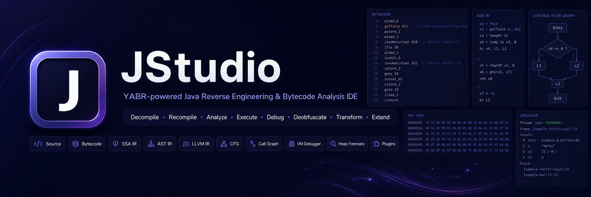
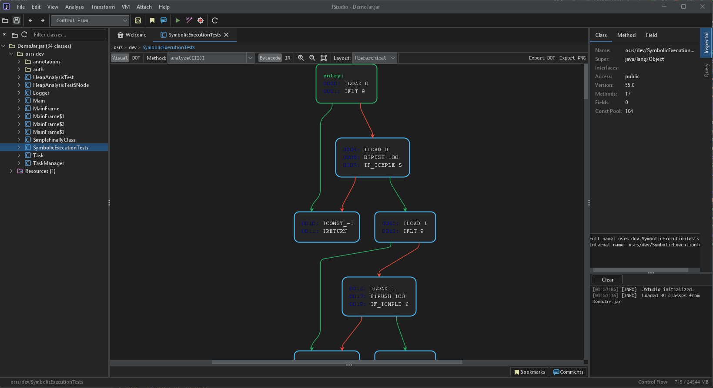

A Java reverse engineering and static analysis IDE for analyzing, decompiling, and transforming Java bytecode.

Powered by [YABR](https://github.com/Tonic-Box/YABR)

## Features

### Multi-View Editor

**Code Views**
- **Source** - Decompiled Java with syntax highlighting
- **Bytecode** - JVM instructions with color-coded opcodes
- **Dual** - Source and bytecode side-by-side, linked by double-click

**IR Views**
- **SSA IR** - Static Single Assignment intermediate representation
- **AST IR** - Abstract Syntax Tree representation

**Graph Views**
- **Control Flow** - Basic block CFG with bytecode/IR toggle
- **Program Dependence** - Data and control dependency graph
- **System Dependence** - Interprocedural dependence graph
- **Code Property** - Unified code property graph
- **Call Graph** - Method call hierarchy with depth control and invoke-type colored edges (virtual, static, special, interface, dynamic)

**Other Views**
- **Const Pool** - Constant pool entry browser with filtering
- **Attributes** - Class, field, and method attributes tree view
- **Statistics** - Class metrics dashboard with charts (method sizes, complexity, opcode distribution)
- **Hex** - Raw class file bytes

### Analysis Tools

- **Call Graph** - Method call hierarchy visualization
- **Pattern Search** - Find method calls, field access, allocations, type casts
- **Similarity** - Detect duplicate and renamed methods
- **Code Analysis** - Find opaque predicates, dead code, decryption patterns
- **Strings** - Extract and search constant pool strings
- **Query Explorer** - Composable query language for code searches — see the [Query DSL reference](docs/query-dsl.md)
- **Cross-References** - Bidirectional symbol reference tracking
- **Usage Lenses** - Clickable "N usages" counts on class, method, and field declarations in the source view that open Find Usages (toggle: View ▸ Usage Counts)

### Bytecode Debugger

- **Breakpoints** - Set breakpoints on any instruction
- **Stepping** - Step into, over, out, run to cursor
- **Variable Inspection** - View and edit locals and stack
- **Call Stack** - Navigate stack frames
- **Execution Modes** - Stub mode (fast) or recursive mode (full)
- **Tracing** - Record execution history, export to Markdown

### Live Debugging (attach to a running JVM)

- **Attach** - Attach to an external running JVM (JDK 11+) and browse its loaded classes via YABR
- **Patch & Continue** - Recompile a class and live-redefine it, grafting only the changed method bodies onto the running class
- **Live heap & statics** - Browse instances from an HPROF snapshot; view/edit static fields and invoke static methods
- **Live profiler** - Per-second live graphs of CPU, heap, metaspace, GC, threads, and loaded classes
- **JFR recorder** - Capture Flight Recorder recordings (CPU/allocation/lock/exception events) from the target, then analyze them in-app (flame graphs, hot methods, allocations, locks, exceptions) with frame-to-source navigation, or export the `.jfr`
- **Threads & Deadlocks** - List threads and detect deadlock cycles from the live wait-for graph
- **Java scratch pad** - Write Java, compile it against the target's classes, and run it inside the attached JVM (stdout/result/exceptions returned)
- **Capture Runtime Classes** - Stream classes defined at runtime (packers, defineHiddenClass, ASM) into the project

See the [Live Debugging reference](docs/live-debugging.md).

### Heap Analysis

- **Object Browser** - Explore allocated objects by class
- **Field Inspection** - View object fields and arrays
- **Snapshots** - Capture and compare heap state
- **Forensics** - Track object creation and mutations

### Test Generation

- **Method Execution** - Run methods with custom arguments
- **Fuzz Testing** - Automated input generation
- **JUnit Export** - Generate JUnit 4/5 test cases

### Deobfuscation

- **String Detection** - Find encrypted strings
- **Decryptor ID** - Locate decryption methods
- **Auto-Decrypt** - Execute decryptors to reveal strings
- **Name Recovery** - Deobfuscate class/method/field names

### Code Transformation

- **Script Editor** - Custom scripting language for AST/bytecode/IR manipulation
- **Optimizations** - Constant folding, copy propagation, dead code elimination, strength reduction
- **Stack Frames** - Recompute stack map frames

### UI

- Tabbed editor with multiple views per class
- Navigator tree with package hierarchy
- Properties panel for metadata
- Console with multi-level logging
- 8 built-in themes

## Building & Running
When running from IDE use the `-dev` flag to disable update checks
```bash
./gradlew run              # Run directly
./gradlew build            # Compile + test + create JAR
./gradlew shadowJar        # Create fat JAR only
```

```bash
java -jar build/libs/JStudio.jar           # Launch GUI
java -jar build/libs/JStudio.jar --cli     # Launch CLI
```

## Usage

1. **Open**: File -> Open (Ctrl+O) to load JAR, directory, or class file
2. **Navigate**: Browse packages and classes in the tree
3. **View**: Switch views using the dropdown or View menu
4. **Analyze**: Use the Analysis menu for graphs and searches, or the Query tab for [DSL queries](docs/query-dsl.md)
5. **Debug**: Right-click method -> Debug Method
6. **Execute**: Right-click method -> Execute Method
7. **Transform**: Use Transform menu for scripts and optimizations

## Keyboard Shortcuts

**File**

| Action | Shortcut |
|--------|----------|
| Open JAR/Class | Ctrl+O |
| Open Recent | Ctrl+Shift+O |
| Save Project | Ctrl+S |
| Save Project As | Ctrl+Shift+S |
| Export Class | Ctrl+Alt+E |
| Export as JAR | Ctrl+Shift+J |
| Close Tab | Ctrl+W |
| Close Project | Ctrl+Shift+W |
| Exit | Ctrl+Q |

**Navigation**

| Action | Shortcut |
|--------|----------|
| Go to Class | Ctrl+G |
| Go to Line | Ctrl+L |
| Navigate Back | Alt+Left |
| Navigate Forward | Alt+Right |

**Edit**

| Action | Shortcut |
|--------|----------|
| Copy | Ctrl+C |
| Find in File | Ctrl+F |
| Find in Project | Ctrl+Shift+F |
| Add Bookmark | Ctrl+B |
| View Bookmarks | Ctrl+Shift+B |
| Add Comment | Ctrl+; |
| Preferences | Ctrl+, |

**Views**

| Action | Shortcut |
|--------|----------|
| Source View | F5 |
| Bytecode View | F6 |
| IR View | F7 |
| Hex View | F8 |
| Refresh | Ctrl+F5 |
| Word Wrap | Alt+Z |

**Panels**

| Action | Shortcut |
|--------|----------|
| Toggle Navigator | Ctrl+1 |
| Toggle Properties | Ctrl+2 |
| Toggle Console | Ctrl+3 |

**Font**

| Action | Shortcut |
|--------|----------|
| Increase Font | Ctrl+= |
| Decrease Font | Ctrl+- |
| Reset Font | Ctrl+0 |

**Analysis**

| Action | Shortcut |
|--------|----------|
| Run Analysis | F9 |
| Code Analysis | F10 |
| Call Graph | Ctrl+Shift+G |

**Transform**

| Action | Shortcut |
|--------|----------|
| Apply Transforms | Ctrl+Shift+T |
| Script Editor | Ctrl+Alt+S |
| String Deobfuscation | Ctrl+Shift+D |

**VM**

| Action | Shortcut |
|--------|----------|
| Bytecode Debugger | F11 |
| VM Console | Ctrl+Shift+C |
| Execute Method | Ctrl+Shift+E |
| Heap Forensics | Ctrl+Shift+H |

**Help**

| Action | Shortcut |
|--------|----------|
| Keyboard Shortcuts | F1 |

## CLI Mode

```bash
java -jar JStudio.jar --cli --help
```

### Commands

```bash
# Display info
java -jar JStudio.jar --cli info app.jar
java -jar JStudio.jar --cli info app.jar --stats --json

# Run plugin/script
java -jar JStudio.jar --cli run app.jar -p script.groovy
java -jar JStudio.jar --cli run app.jar -p plugin.jar -o results.json

# Interactive REPL
java -jar JStudio.jar --cli repl app.jar

# Batch processing
java -jar JStudio.jar --cli batch *.jar -p analyzer.groovy --parallel
```

### REPL Commands

| Command | Description |
|---------|-------------|
| `:load <path>` | Load JAR/class/directory |
| `:classes [pattern]` | List classes |
| `:methods <class>` | List methods |
| `:info <class>` | Show class details |
| `:run <script>` | Execute script |
| `:quit` | Exit |

## Dependencies

- [FlatLaf](https://www.formdev.com/flatlaf/) - Swing look and feel
- [RSyntaxTextArea](https://github.com/bobbylight/RSyntaxTextArea) - Syntax highlighting
- [JGraphX](https://github.com/jgraph/jgraphx) - Graph visualization
- [JavaParser](https://javaparser.org/) - Java parsing
- [YABR](https://github.com/Tonic-Box/YABR) - Bytecode analysis
- [picocli](https://picocli.info/) - CLI framework
- [JLine](https://github.com/jline/jline3) - Terminal handling
- [Groovy](https://groovy-lang.org/) - Scripting support

## License

MIT
